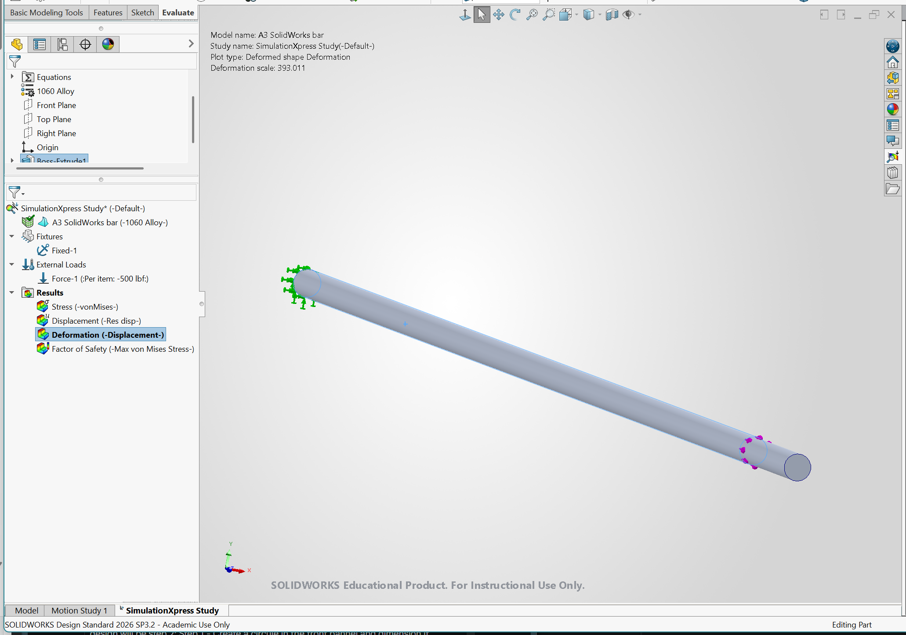
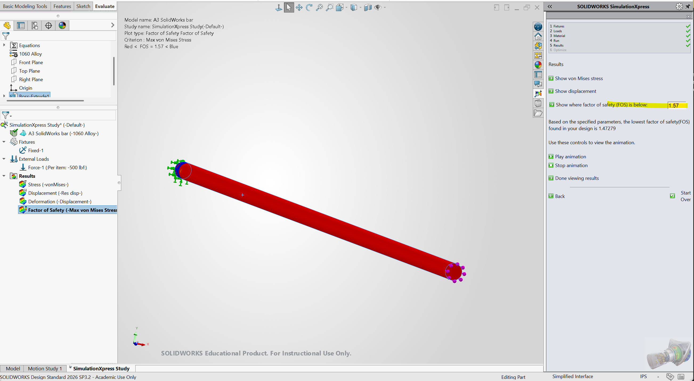

# A3: Parametric and FEA Report

## Section 1: Parametric Design

### 1.a Inputs & Parameters
* **Shape:** Solid Circular Bar
* **Diameter ($d$):** $0.50 \text{ in}$
* **Cross-Sectional Area ($A$):** 
  $$A = \frac{\pi \cdot d^2}{4} = \frac{3.1416 \times (0.50)^2}{4} = 0.19635 \text{ in}^2 \approx 0.20 \text{ in}^2$$
* **Load ($F$):** $500.00 \text{ lbf}$
* **Max Deflection ($\delta$):** $0.009 \text{ in}$
* **Material:** 1060 Alloy Aluminum
* **Young's Modulus ($E$):** $10,007,603.90 \text{ psi}$

---

### 1.b Hand Calculation for Length
Using the direct tension elongation formula:
$$\delta = \frac{F \cdot L}{A \cdot E} \implies L = \frac{\delta \cdot A \cdot E}{F}$$

Substituting the parameter values:
$$L = \frac{0.009 \text{ in} \times 0.19635 \text{ in}^2 \times 10,007,603.90 \text{ psi}}{500.00 \text{ lbf}} = 35.37 \text{ in}$$

---

### 1.c CAD Parametric Setup

**Global Equations Table:**

**Step 1:** Create a circle on the Front Plane and dimension its diameter to the global variable `"d"`.

**Step 2:** Extrude the circle to the global variable `"L"` length ($35.37 \text{ in}$).

**Material Selection:**

---

## Section 2: FEA (Finite Element Analysis)

> **Note:** Unable to do mesh since SolidWorks Student account has limitations on simulation and only provides the SimulationXpress wizard option.

* **Boundary Conditions:** Fixed one circular end face; applied $500 \text{ lbf}$ axial tensile load to the opposite end face.
* **Axial Deflection:** $0.0090 \text{ in}$
* **Nominal Stress ($\sigma$):**
  $$\sigma = \frac{F}{A} = \frac{500 \text{ lbf}}{0.19635 \text{ in}^2} = 2,546.5 \text{ psi} \approx 2.55 \text{ ksi}$$
* **Yield Strength ($S_y$):** $3,999.30 \text{ psi} \approx 4.00 \text{ ksi}$
* **Factor of Safety (FOS):**
  $$\text{FOS} = \frac{S_y}{\sigma} = \frac{3,999.30 \text{ psi}}{2,546.5 \text{ psi}} = 1.57$$

---

## Section 3: Design Reflection

### 3.a Hand-Calc vs. FEA Comparison
* **Hand-calc Deflection ($\delta_{\text{hand}}$):** $0.0090 \text{ in}$
* **FEA Deflection ($\delta_{\text{FEA}}$):** $0.0090 \text{ in}$
* **Percent Difference:** $0.00\%$
* **Explanation:** The hand calculation and FEA match completely because the geometry is a simple uniform cylinder under pure axial tension. There are no stress concentrations or bending moments, making the standard 1D formula exact.
* **Trusted Result:** Both results are equally trustworthy for this simple geometry.

### 3.b Pin Hole Stress Concentration Analysis
* **Stress Concentration Factor ($K_t$):** $\approx 2.50$
* **Estimated Peak Stress:**
  $$\sigma_{\text{peak}} = K_t \times \sigma = 2.50 \times 2,546.5 \text{ psi} = 6,366.25 \text{ psi} \approx 6.37 \text{ ksi}$$
* **Safety Factor with Hole:**
  $$\text{FOS}_{\text{hole}} = \frac{3,999.30 \text{ psi}}{6,366.25 \text{ psi}} = 0.63$$
* **Conclusion:** Peak stress ($6.37 \text{ ksi}$) exceeds yield strength ($4.00 \text{ ksi}$), so the safety factor falls below $1.0$ and the part would yield around the hole.

### Project Images
* **Deformation Map:**  
  
* **Displacement Map:**  
  
* **Stress Map:**  
  
* **Factor of Safety Plot:**  
  

### Downloads & Files
* [SolidWorks CAD Part File (`A3 SolidWorks bar.SLDPRT`)](A3%20SolidWorks%20bar.SLDPRT)
* [SimulationXpress FEA PDF Report](A3%20SolidWorks%20bar-SimulationXpress%20Study-1.pdf)

---

## Section 4: Lessons Learned
* **Mistakes:** 1060 Alloy has a lower yield strength ($4 \text{ ksi}$) than standard structural alloys like 6061-T6 Aluminum ($40 \text{ ksi}$), which reduces the safety margin significantly.
* **Time Spent:** 1.5 hours total.

---

## Resources & Links
1. [Parametric Modeling & FEA Videos](https://instructure.charlotte.edu/courses/272052/pages/parametric-modeling-and-fea-finite-element-analysis-videos?module_item_id=7950950)
2. AI used to format Markdown, embed images, and link CAD files.

---

