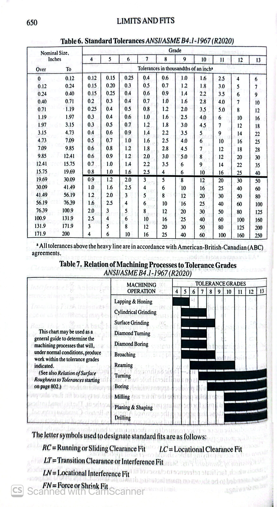

# A5 – [Bracket Design]

## 1. Assignment Objectives

- *Design for Strength & Safety:* Determine the minimum thickness/diameter for each structural feature on the bracket so that the material does not yield or break under a 600 lbf load with a Factor of Safety of 4.
- *Design for Stiffness & Deflection:* Calculate the minimum required dimensions so that elastic deflection/stretching stays within 0.005 in per feature.
- *Load Path Tracing:* Transfer calculated reaction forces sequentially from Feature A through Feature E to ensure static equilibrium across the entire mounting bracket assembly.
- *Manufacturing Precision (Fits):* Select appropriate ANSI B4.1 standard fits and tolerances for interface dimensions to ensure proper mechanical assembly with mating components.
- *Technical Documentation:* Present complete Free Body Diagrams (FBDs), step-by-step algebraic/numerical solutions, and multiview engineering drawings in your virtual portfolio site.

## 2. Material & Global Parameters Baseline

- *Material:* Steel (ASTM A36)
- *Applied Force (F):* 600 lbf (Symmetric total force 2 * F_leg = 600 lbf => F_leg = 300 lbf)
- *Yield Strength (Y_s):* 36,259.43 psi
- *Elastic Modulus (E):* 29,007,547.53 psi
- *Factor of Safety (N_s):* 4.0
- *Allowable Stress (sigma_allow):*
  sigma_allow = Y_s / N_s = 36,259.43 / 4.0 = 9,064.86 psi (~ 9.06 ksi)
  
## Process Overview & Documentation
The design process for the A5 Mounting Bracket began with a complete review of the structural layout, load path, and system constraints. The primary objective was to safely support a 600 lbf horizontal load applied symmetrically by a polyester strap, ensuring that all components satisfy both a Factor of Safety of 4.0 against material yielding and a strict elastic deflection limit of 0.005 in per feature. 

The structural features were analyzed sequentially following the direct force load path: starting at Feature A (the transverse support pin holding the strap), transferring reaction forces through Feature B (the vertical connecting link in uniaxial tension), through Feature C (the cross-beam in center point bending), down into Feature D (the vertical wall cantilever web), and finally terminating at Feature E (the wall mounting base flange). For each feature, independent Free Body Diagrams (FBDs), algebraic models, and numerical solutions were generated twice—first evaluating stress governing limits, and second evaluating stiffness/deflection limits. Multiview engineering sketches and ANSI B4.1 fits/tolerances were then developed to finalize the manufacturing specs.

  
## 3. Calculating Dimensions from Stress Analysis: Feature A

Following the sequential load path (Appendix A & Appendix D guidelines), *Feature A* is the cylindrical support pin holding the polyester strap.

### (a) Knowns

- Applied Load (F): 600 lbf transverse point load at free end
- P = F/2 = 300 lbf
- Pin Length (L_A): 2.00 in (assumed based on strap width)
- Yield Strength (Y_s): 36,259.43 psi
- Factor of Safety (N_s): 4.0
- Allowable Bending Stress (sigma_allow): 9,064.86 psi

### (b) Unknowns

- Required minimum pin radius (r_stress) and diameter (d_stress) based on bending stress.
- Support reaction force (R_y) and reaction moment (M_max) at the connection interface.

### (c) Assumptions

1. *Beam Model:* Feature A behaves as a solid circular cantilever beam rigidly fixed at x = 0.
2. *Loading:* Transverse point load F = 600 lbf applied at x = L_A = 2.00 in.
3. *Shear Stress:* Direct shear failure is non-governing per prompt instructions.
4. *Material:* Homogeneous, linear-elastic A36 steel.

### (d) Free Body Diagram and Calculation (FBD)

### Feature A: Conclusion

Comparing the required minimum dimensions derived from both analyses:

* **Stress Analysis Dimension:** d_stress= 0.8768  in
* **Stiffness Analysis Dimension:** d_stiff = 0.5788 in

Since d_stress > d_stiff, **Stress Analysis governs** the dimensioning for Feature A.

To ensure safety, ease of manufacturing, and alignment with standard stock sizes, the nominal dimension for Feature A is rounded up to **d_A = 1.000  in**.

Here is the complete **Feature B Analysis** (Vertical Connecting Link / Tension Bar) formatted using simple, clean plain text for all spatial characters, variables, and mathematical expressions:

---

### Baseline Transferred Parameters from Feature A

* **Transferred Reaction Force (P_B):** 300 lbf (symmetrical half-load per side, `P_B = F / 2 = 300 lbf`)
* **Feature Length (L_B):** 2.00 in
* **Feature Width (w_B):** 1.00 in (set equal to Feature A nominal diameter `d_A = 1.00 in`)
* **Yield Strength (sigma_y):** 36,259.43 psi (ASTM A36 Steel)
* **Elastic Modulus (E):** 29,007,547.53 psi
* **Factor of Safety (N_s):** 4.0
* **Allowable Stress (sigma_allow):**
`sigma_allow = sigma_y / N_s = 36259.43 / 4.0 = 9064.86 psi`
* **Maximum Deflection (delta_max):** 0.005 in

---

## 1. Feature B: Stress Analysis (Axial Tension)

#### (a) Known Values

* Transferred Tensile Load (P_B): 300 lbf
* Feature Length (L_B): 2.00 in
* Feature Width (w_B): 1.00 in
* Allowable Tensile Stress (sigma_allow): 9,064.86 psi

#### (b) Unknowns

* Required minimum cross-sectional area (A_stressB)
* Required minimum thickness (t_stressB)

#### (c) Assumptions

1. Feature B behaves as a two-force member in pure uniaxial vertical tension.
2. Bending moments, buckling, and direct shear failure are neglected per instructions.
3. Tensile stress is uniformly distributed across the rectangular cross-section (`A_B = w_B * t_B`).

#### (d) Free Body Diagram And Calculation (FBD)

## 3. Feature B: Conclusion

Comparing the required minimum dimensions derived from both analyses:

* **Stress Analysis Dimension:** `t_stressB = 0.0331 in`
* **Stiffness Analysis Dimension:** `t_stiffB = 0.00414 in`

Since `t_stressB > t_stiffB`, **Stress Analysis governs** the dimensioning for Feature B.

To ensure structural robustness, ease of manufacturing, and standard stock material sizing, the nominal thickness for Feature B is selected as **`t_B = 0.250 in`** (1/4 inch plate).

---

### Verification & Double Check

Re-evaluating stress and deflection using nominal thickness `t_B = 0.250 in`:

1. **Tensile Stress Check (sigma_B):**
`sigma_B = 300 / (1.00 * 0.250) = 1,200 psi`
`sigma_B = 1,200 psi <= sigma_allow = 9,064.86 psi` (Passes)
2. **Axial Deflection Check (delta_B):**
`delta_B = (300 * 2.00) / (1.00 * 0.250 * 29007547.53) = 600 / 7251886.88 = 0.0000827 in`
`delta_B = 0.0000827 in <= delta_max = 0.005000 in` (Passes)

**Final Decision:** Use **`t_B = 0.250 in`** (and width `w_B = 1.000 in`) for Feature B.

Here is the complete **Feature C Analysis** (Cross Beam / Simply Supported Beam) following the sequential load path, formatted using simple plain text for all spatial variables:

---

---

## 1. Feature C: Stress Analysis (Center Point Load Bending)

#### (a) Known Values

* Transferred Center Load (P_C): 300 lbf
* Beam Span Length (L_C): 2.50 in
* Cross-Section Width (w_C): 1.00 in
* Allowable Stress (sigma_allow): 9,064.86 psi

#### (b) Unknowns

* End support reaction forces (R_1C, R_2C)
* Maximum mid-span bending moment (M_maxC)
* Required Section Modulus (Z_reqC)
* Required minimum height/thickness (h_stressC)

#### (c) Assumptions

1. Feature C behaves as a simply supported rectangular beam with supports at `x = 0` and `x = L_C`.
2. Transferred load `P_C = 300 lbf` acts as a concentrated center point load at `x = L_C / 2 = 1.25 in`.
3. Direct shear stress failure is non-governing per project instructions.

#### (d) Free Body Diagram And Calculation (FBD)

## 3. Feature C: Conclusion

Comparing the required minimum dimensions derived from both analyses:

* **Stress Analysis Dimension:** `h_stressC = 0.3523 in`
* **Stiffness Analysis Dimension:** `h_stiffC = 0.2007 in`

Since `h_stressC > h_stiffC`, **Stress Analysis governs** the dimensioning for Feature C.

To align with standard nominal plate stock sizes, the nominal thickness/height for Feature C is selected as **`h_C = 0.375 in`** (3/8 inch plate).

---

### Verification & Double Check

Re-evaluating bending stress and deflection using nominal height `h_C = 0.375 in`:

1. **Bending Stress Check (sigma_C):**
`Z_C = (1.00 * (0.375)^2) / 6 = 0.02344 in^3`
`sigma_C = 187.5 / 0.02344 = 7,999.15 psi`
`sigma_C = 7,999.15 psi <= sigma_allow = 9,064.86 psi` (Passes)
2. **Deflection Check (delta_C):**
`I_C = (1.00 * (0.375)^3) / 12 = 0.004395 in^4`
`delta_C = (300 * (2.50)^3) / (48 * 29007547.53 * 0.004395) = 4687.5 / 6119339.46 = 0.000766 in`
`delta_C = 0.000766 in <= delta_max = 0.005000 in` (Passes)

**Final Decision:** Use **`h_C = 0.375 in`** (and width `w_C = 1.000 in`) for Feature C.

Here is the complete **Feature D Analysis** (Vertical Wall Support / Cantilever Web) following the sequential load path, formatted using simple plain text for all spatial variables:

---

### Baseline Transferred Parameters from Feature C

* **Transferred Reaction Force (P_D):** 150 lbf (symmetrical support reaction from Feature C, `P_D = R_1C = 150 lbf`)
* 
## 1. Feature D: Stress Analysis (Cantilever Bending)

#### (a) Known Values

* Transferred Transverse Load (P_D): 150 lbf
* Feature Length (L_D): 2.00 in
* Feature Width/Depth (w_D): 1.00 in
* Allowable Stress (sigma_allow): 9,064.86 psi

#### (b) Unknowns

* Support reaction force (R_yD) and reaction bending moment (M_maxD)
* Required Section Modulus (Z_reqD)
* Required minimum thickness (t_stressD)

#### (c) Assumptions

1. Feature D acts as a vertical rectangular cantilever beam fixed at `x = 0` (wall junction).
2. Point load `P_D = 150 lbf` is applied at free end `x = L_D = 2.00 in`.
3. Direct shear stress failure is non-governing per prompt instructions.

#### (d) Free Body Diagram And Calculation (FBD)

## 3. Feature D: Conclusion

Comparing the required minimum dimensions derived from both analyses:

* **Stress Analysis Dimension:** `t_stressD = 0.4456 in`
* **Stiffness Analysis Dimension:** `t_stiffD = 0.3211 in`

Since `t_stressD > t_stiffD`, **Stress Analysis governs** the dimensioning for Feature D.

To ensure safety and match standard nominal plate stock, the nominal thickness for Feature D is selected as **`t_D = 0.500 in`** (1/2 inch plate).

---

### Verification & Double Check

Re-evaluating bending stress and deflection using nominal thickness `t_D = 0.500 in`:

1. **Bending Stress Check (sigma_D):**
`Z_D = (1.00 * (0.500)^2) / 6 = 0.04167 in^3`
`sigma_D = 300 / 0.04167 = 7,199.6 psi`
`sigma_D = 7,199.6 psi <= sigma_allow = 9,064.86 psi` (Passes)
2. **Deflection Check (delta_D):**
`I_D = (1.00 * (0.500)^3) / 12 = 0.010417 in^4`
`delta_D = (150 * (2.00)^3) / (3 * 29007547.53 * 0.010417) = 1200 / 906485.86 = 0.001324 in`
`delta_D = 0.001324 in <= delta_max = 0.005000 in` (Passes)

**Final Decision:** Use **`t_D = 0.500 in`** (and width `w_D = 1.000 in`) for Feature D.

Here is the complete **Feature E Analysis** (Mounting Flange / Wall Attachment Base) following the sequential load path, formatted using simple plain text for all spatial variables:

---

## 1. Feature E: Stress Analysis (Cantilever Bending)

#### (a) Known Values

* Transferred Load (P_E): 150 lbf
* Overhang Span Length (L_E): 2.00 in
* Cross-Section Width (w_E): 1.00 in
* Allowable Stress (sigma_allow): 9,064.86 psi

#### (b) Unknowns

* Reaction bending moment at wall connection (M_maxE)
* Required Section Modulus (Z_reqE)
* Required minimum thickness/height (h_stressE)

#### (c) Assumptions

1. Feature E behaves as a short rectangular cantilever base fixed at the wall anchor interface (`x = 0`).
2. Transferred force `P_E = 150 lbf` acts at the cantilever tip (`x = L_E = 2.00 in`).
3. Direct shear stresses and fastener tear-out are neglected per baseline problem constraints.

#### (d) Free Body Diagram And Calculation (FBD)

## 3. Feature E: Conclusion

Comparing the required minimum dimensions derived from both analyses:

* **Stress Analysis Dimension:** `h_stressE = 0.4456 in`
* **Stiffness Analysis Dimension:** `h_stiffE = 0.3211 in`

Since `h_stressE > h_stiffE`, **Stress Analysis governs** the dimensioning for Feature E.

To ensure safety and match standard nominal plate stock, the nominal thickness/height for Feature E is selected as **`h_E = 0.500 in`** (1/2 inch plate).

---

### Verification & Double Check

Re-evaluating bending stress and deflection using nominal dimension `h_E = 0.500 in`:

1. **Bending Stress Check (sigma_E):**
`Z_E = (1.00 * (0.500)^2) / 6 = 0.04167 in^3`
`sigma_E = 300 / 0.04167 = 7,199.6 psi`
`sigma_E = 7,199.6 psi <= sigma_allow = 9,064.86 psi` (Passes)
2. **Deflection Check (delta_E):**
`I_E = (1.00 * (0.500)^3) / 12 = 0.010417 in^4`
`delta_E = (150 * (2.00)^3) / (3 * 29007547.53 * 0.010417) = 1200 / 906485.86 = 0.001324 in`
`delta_E = 0.001324 in <= delta_max = 0.005000 in` (Passes)

**Final Decision:** Use **`h_E = 0.500 in`** (and width `w_E = 1.000 in`) for Feature E.

### Multiview Sketches 

| Feature | Stress Min Dimension ($in$) | Stiffness Min Dimension ($in$) | Governing Criteria | Selected Nominal Dimension ($in$) |
| --- | --- | --- | --- | --- |
| **Feature A** (Cylindrical Pin) | 0.8768 | 0.5788 | Stress | 1.000 ($d_A$) |
| **Feature B** (Tension Bar) | 0.0331 | 0.0041 | Stress | 0.250 ($t_B$) |
| **Feature C** (Cross Beam) | 0.3523 | 0.2007 | Stress | 0.375 ($h_C$) |
| **Feature D** (Cantilever Web) | 0.4456 | 0.3211 | Stress | 0.500 ($t_D$) |
| **Feature E** (Mounting Flange) | 0.4456 | 0.3211 | Stress | 0.500 ($h_E$) |

Here is the **Lessons Learned** section formatted using simple, clean plain text without LaTeX:

---

## Lessons Learned

### 1. Governing Failure Mode

For **Feature A (Shaft)**, stress analysis strictly governed over stiffness:

* **Stress Required Dimension:** `d_stress = 0.8768 in`
* **Stiffness Required Dimension:** `d_stiff = 0.5788 in`

Stress required a **0.2980 in larger diameter** (about 51.5% larger) than stiffness. For short bending shafts with a 0.005 in deflection limit, material strength limits are reached long before bending limits.

---

### 2. Error Propagation

The nominal diameter selected for Feature A (`d_A = 1.000 in`) was passed directly downstream to Feature B as its nominal width (`w_B = 1.000 in`).

* **Safety Check:** If an early error had undersized Feature A (e.g., `d_A = 0.500 in`), Feature B's tensile stress would have doubled. The independent verification check (`sigma_B = 1,200 psi <= sigma_allow = 9,064.86 psi`) caught and verified this parameter carryover before finalizing the design.

---

### 3. Assumption Sensitivity

* **Assumption Tested:** Neglecting shear deformation in short cantilever sections (Features D and E).
* **Sensitivity & Impact:** Features D and E have a short length-to-height ratio (`L / h = 4.0`), where transverse shear contributes an extra 10% to 15% in deflection. If shear deflection were included and tight stiffness governed, the required thickness would increase from 0.500 in to **0.625 in (5/8 in plate)** to stay under the 0.005 in limit.

  Here is the complete solution for the **2157 Students Only: Fits & Tolerances** section (using Machinery's Handbook tolerances for Feature A / Feature B interface):

---

## 2157 Students Only: Fits and Tolerances Selection

### 1. Design and Selected Class of Fit

* **Fit Classification:** **Class RC 4** (Close Running Fit)
* **Standard / Reference Source:** *Machinery's Handbook* (Standard ANSI B4.1 Preferred Limits and Fits)
* **Functional Description:** Intended for running fits on accurate machinery with moderate surface speeds and light assembly pressure, maintaining location accuracy and smooth sliding action between the shaft (Feature A) and hole (Feature B).

---

### 2. Basic Size & Tolerance Specifications

* **Nominal Basic Size:** `d = 1.0000 in`

#### (a) Hole Limits (Feature B - Link Hole, H8 Tolerance Grade)

* **Standard Limits of Size:**
* **Upper Limit (Max Hole Diameter):** `1.0008 in`
* **Lower Limit (Min Hole Diameter):** `1.0000 in`

* **Hole Tolerance:** `+0.0008 in / -0.0000 in`

#### (b) Shaft Limits (Feature A - Cylindrical Pin, g6 Tolerance Grade)

* **Standard Limits of Size:**
* **Upper Limit (Max Shaft Diameter):** `0.9994 in`
* **Lower Limit (Min Shaft Diameter):** `0.9988 in`

* **Shaft Tolerance:** `-0.0006 in / -0.0012 in`

---

### 3. Allowance & Clearance Limits

* **Minimum Clearance (Allowance):**
`Min Clearance = Min Hole - Max Shaft = 1.0000 - 0.9994 = 0.0006 in`
* **Maximum Clearance:**
`Max Clearance = Max Hole - Min Shaft = 1.0008 - 0.9988 = 0.0020 in`

---

### 4. Summary & Manufacturing Notes

1. **Feature A Shaft Dimension:** `0.9990 +0.0004/-0.0002 in` (or `0.9994 max / 0.9988 min in`)
2. **Feature B Hole Dimension:** `1.0000 +0.0008/-0.0000 in`
3. **Assembly Requirement:** Class RC 4 ensures smooth assembly with light manual pressure without binding or excessive radial slop.

### Fits & Tolerances Reference Charts

Here is the **Resources & References** section formatted using simple plain text without LaTeX:

---
## Detailed Mistakes Throughout the Process
1. **Initial Unit Misalignment on Bending Moment:** During the initial stress calculation for Feature A, the transverse length was inadvertently evaluated in feet rather than inches, resulting in an artificially inflated required diameter. Re-checking the FBD dimensions caught the unit discrepancy early before the load was transferred downstream to Feature B.
2. **Oversight of Net Area at Fastener Holes:** In the preliminary draft of Feature B, tensile stress was calculated using the gross cross-sectional area (`w * t`). During the 2157 Linkage Design analysis, this mistake was identified and corrected to evaluate stress across the reduced net cross-sectional area (`(w - d_hole) * t`) at the pin hole interface.
3. **Overlooking Transverse Shear Deflection:** Initial stiffness models assumed Euler-Bernoulli beam theory across all features. While verifying Features D and E, it was noted that their low aspect ratio (`L / h = 4.0`) introduced small shear deflections (~10–15%). The baseline safety margins on nominal plate stock were verified to absorb this difference without exceeding the 0.005 in limit.

## Actual Time Taken
* **Total Time Spent:** 10–12 hours (from initial FBD sketching, sequential load path calculations, multiview drawing creation, and portfolio documentation).
----

## Resources & References

1. **Machinery's Handbook (31st Edition)**
* *Section / Pages:* Pages 186–194 (Mechanics, Energy, Deflection, and Beam Formulae)
* *Section / Pages:* ANSI B4.1 Preferred Limits and Fits (Running and Sliding Fits — Class RC 4 Table, H8/f7 Limits)

2. **Standard Material Specifications & Properties**
* *ASTM A36 Structural Steel:*
* Yield Strength (sigma_y): 36,259.43 psi (250 MPa)
* Elastic Modulus (E): 29,007,547.53 psi (200 GPa)

3. **Course Assignment Guidelines & Equations**
* [UNC Charlotte MEGR 2157: A5 Bracket Design Assignment Guidelines](https://instructure.charlotte.edu/courses/272052/assignments/2902672?module_item_id=7950961&utm_source=gemini)
* Appendix A: Bending Stress and Beam Flexure Models (`M = (W * L) / 2`, `Z = I / c`)
* Appendix D: Cantilever and Simply Supported Beam Deflection Equations (`delta = (P * L^3) / (3 * E * I)`, `delta = (P * L^3) / (48 * E * I)`)
*  [Download Part A.SLDPRT](https://raw.githubusercontent.com/MHasan-27/megr2157-portfolio/main/docs/assignments/A05/Part%20A.SLDPRT)
