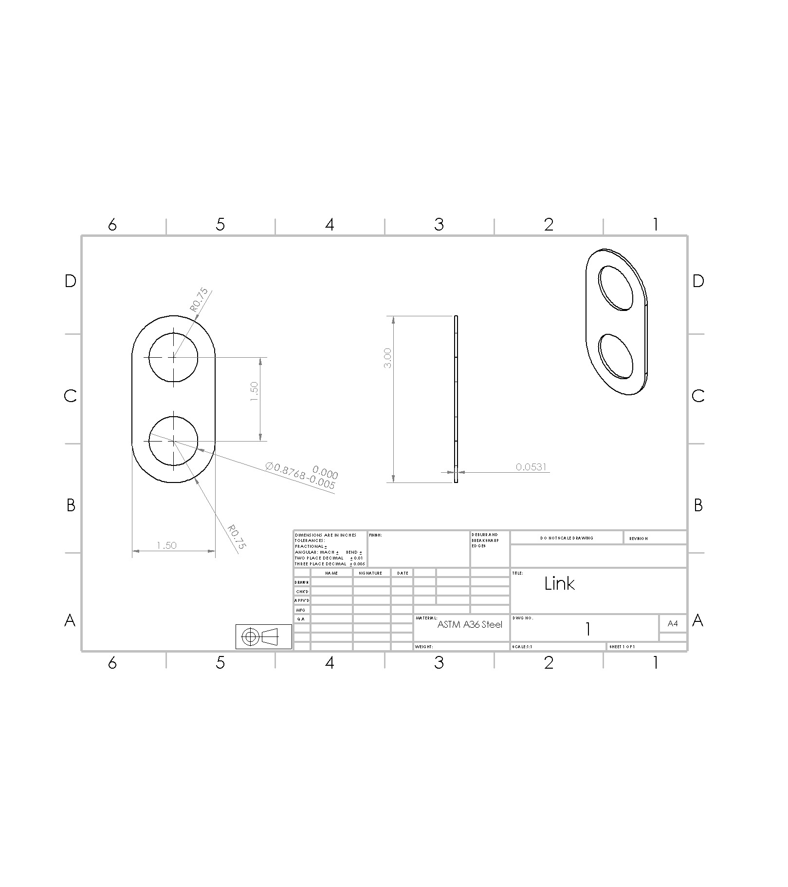

# A6: Bracket Drawing (Drawings Part 1)

## Download CAD & Drawing Files
- **Bracket Solid Model:** [A6 Bracket Drawing.SLDPRT](https://github.com/MHasan-27/megr2157-portfolio/blob/main/docs/assignments/A06/A6%20Bracket%20Drawing.SLDPRT)
- **Bracket Engineering Drawing:** [A6 Bracket Drawing.SLDDRW](https://github.com/MHasan-27/megr2157-portfolio/blob/main/docs/assignments/A06/A6%20Bracket%20Drawing.SLDDRW)
- **Link Solid Model (2157 Only):** [Link.SLDPRT](https://github.com/MHasan-27/megr2157-portfolio/blob/main/docs/assignments/A06/Link.SLDPRT)
- **Link Engineering Drawing (2157 Only):** [Link.SLDDRW](https://github.com/MHasan-27/megr2157-portfolio/blob/main/docs/assignments/A06/Link.SLDDRW)

---

## 1. Parametric Design

### Global Variables & Equations Table
To make the CAD model fully dynamic and driven purely by analytical failure criteria, every feature dimension is parametrically tied to its exact calculated **stress dimension** from Assignment 5 rather than rounded nominal stock sizes.

| Name | Value / Equation | Evaluates to | Comments |
| :--- | :--- | :--- | :--- |
| `"F"` | `= 600` | `600.00` | Applied Load [lbf] |
| `"P"` | `= "F" / 2` | `300.00` | Symmetric Leg Force [lbf] |
| `"Ys"` | `= 36259.43` | `36259.43` | Material Yield Strength (ASTM A36) [psi] |
| `"E"` | `= 29007547.53` | `29007547.53` | Elastic Modulus (ASTM A36) [psi] |
| `"Ns"` | `= 4.0` | `4.00` | Factor of Safety |
| `"sigma_allow"`| `= "Ys" / "Ns"` | `9064.86` | Allowable Stress [psi] |
| `"delta_max"` | `= 0.005` | `0.005` | Maximum Deflection Limit [in] |
| `"L_A"` | `= 2.00` | `2.00` | Feature A Pin Length [in] |
| `"d_stress_A"` | `= ((32 * "P" * "L_A") / (pi * "sigma_allow"))^(1/3)` | `0.8768` | Feature A Pin Stress Diameter [in] |
| `"w_B"` | `= "d_stress_A"` | `0.8768` | Feature B Width (Tied to Pin Stress Dia) [in] |
| `"L_B"` | `= 2.00` | `2.00` | Feature B Link Length [in] |
| `"t_stress_B"` | `= "P" / ("w_B" * "sigma_allow")` | `0.0378` | Feature B Min Stress Thickness [in] |
| `"L_C"` | `= 2.50` | `2.50` | Feature C Beam Span Length [in] |
| `"w_C"` | `= "d_stress_A"` | `0.8768` | Feature C Beam Cross-Section Width [in] |
| `"h_stress_C"` | `= ((1.5 * "P" * "L_C") / ("w_C" * "sigma_allow"))^(1/2)` | `0.3764` | Feature C Min Bending Stress Height [in] |
| `"P_D"` | `= "P" / 2` | `150.00` | Feature D Reaction Load from Beam [lbf] |
| `"L_D"` | `= 2.00` | `2.00` | Feature D Web Cantilever Length [in] |
| `"w_D"` | `= "d_stress_A"` | `0.8768` | Feature D Web Width [in] |
| `"t_stress_D"` | `= ((6 * "P_D" * "L_D") / ("w_D" * "sigma_allow"))^(1/2)` | `0.4759` | Feature D Min Bending Stress Thickness [in] |
| `"P_E"` | `= "P_D"` | `150.00` | Feature E Transferred Flange Load [lbf] |
| `"L_E"` | `= 2.00` | `2.00` | Feature E Flange Overhang Span [in] |
| `"w_E"` | `= "d_stress_A"` | `0.8768` | Feature E Flange Width [in] |
| `"h_stress_E"` | `= ((6 * "P_E" * "L_E") / ("w_E" * "sigma_allow"))^(1/2)` | `0.4759` | Feature E Min Bending Stress Thickness [in] |

---

### Step-by-Step Modeling Process

#### Step 1: Sketch Feature B Profile
Started the modeling sequence with Feature B to establish a simple, clean design path. Sketched the vertical link cross-section bound to width parameter `"w_B"` ($0.8768\text{ in}$).

#### Step 2: Extrude Feature B
Extruded the Feature B sketch to the calculated minimum stress thickness using parameter `"t_stress_B"` ($0.0378\text{ in}$).

#### Step 3: Sketch Feature A
Sketched the Feature A cylindrical pin profile directly onto the face of Feature B, referencing diameter parameter `"d_stress_A"` ($0.8768\text{ in}$).

#### Step 4: Extrude Feature A
Extruded Feature A outward by the full pin length parameter `"L_A"` ($2.00\text{ in}$).

#### Step 5: Extrude Block for Features C, D, and E
Constructed a solid base block encompassing the outer envelope dimensions for Features C, D, and E, then extruded the block across length `"L_D"` ($2.00\text{ in}$).

#### Step 6: Sketch & Cut-Extrude Final Profile
Sketched the exact cutout profiles for Features C, D, and E using parameters `"h_stress_C"` ($0.3764\text{ in}$), `"t_stress_D"` ($0.4759\text{ in}$), and `"h_stress_E"` ($0.4759\text{ in}$), then performed a Cut-Extrude to remove excess material and achieve the final bracket geometry.

---

## 2. Multi-View Engineering Drawing & Tolerancing

### Projection & Layout
The drawing was created on an ANSI standard sheet in **Third Angle Projection** conforming to ASME Y14.3 standards.

### Tolerance Block & Fits
A standard title block tolerance note was applied across the drawing:
- `X.X ± .02`
- `X.XX ± .01`
- `X.XXX ± .005`

The T-slot sliding interface over the rigid beam was dimensioned using the tighter `X.XXX ± .005` tolerance to guarantee smooth linear motion without excessive play or binding under dynamic load conditions.

---

## 3. Reflections & Analytical Justification

### Analytical Driving Equation
Feature A (Pin Diameter $d_A$) was directly driven by the maximum bending stress equation for a circular cantilever pin:

$$\sigma = \frac{M c}{I} = \frac{32 P L_A}{\pi d_A^3} \implies d_A = \sqrt[3]{\frac{32 \cdot P \cdot L_A}{\pi \cdot \sigma_{allow}}}$$

In SolidWorks Equation Manager, this was bound as:
`"d_stress_A" = ((32 * "P" * "L_A") / (pi * "sigma_allow"))^(1/3)`

Rather than overriding the model with a rounded nominal value, `"d_stress_A"` ($0.8768\text{ in}$) directly forms the geometry of Feature A. When allowable stress $\sigma_{allow}$ or load $P$ changes, SolidWorks re-evaluates `"d_stress_A"`, and dependent features across the feature tree update automatically.

### Tolerancing & Manufacturing Justification
- **Tighter Class (`X.XXX ± .005`):** Applied to the T-slot sliding channel. Because this surface forms a precision sliding fit over the rigid beam, tight control over dimensions prevents joint backlash, jamming, and uneven wear.
- **Looser Class (`X.XX ± .01`):** Applied to outer structural fillets and non-mating plate lengths. These surfaces do not engage with mating parts.
- **Cost & Feasibility Impact:** Defaulting to tight tolerances across non-critical dimensions forces machinists to use slower feed rates, finer tooling passes, and rigorous CMM inspection routines, significantly increasing manufacturing costs and scrap rates without providing functional benefit.

### Time Log
- **Parametric CAD Modeling:** 2.5 hours
- **Engineering Drawing & GD&T Setup:** 2.0 hours
- **2157 Link Design & Drawing:** 1.5 hours
- **Documentation & Portfolio Formatting:** 1.0 hour
- **Total Time Spent:** 7.0 hours

---

## 4. 2157 Students Only (20%) – Connecting Link Design

### Parametric Link Equations
A connecting link was modeled to attach to the bracket's Feature A pin interface ($d_A = d_{stress\_A} = 0.8768\text{ in}$). The hole diameter and net width are parametrically driven by stress calculations.

| Name | Value / Equation | Evaluates to | Comments |
| :--- | :--- | :--- | :--- |
| `"P"` | `= 300` | `300.00` | Tensile Load [lbf] |
| `"sigma_allow"`| `= 9064.86` | `9064.86` | Allowable Stress [psi] |
| `"E"` | `= 29007547.53` | `29007547.53` | Elastic Modulus [psi] |
| `"w_link"` | `= 1.50` | `1.50` | Link Overall Width [in] |
| `"L_link"` | `= 3.00` | `3.00` | Total Link Length [in] |
| `"d_hole"` | `= "d_stress_A"` | `0.8768` | Pin Hole Diameter (Driven by Feature A Stress Dim) [in] |
| `"center_dist"`| `= 2.00` | `2.00` | Center-to-Center Distance [in] |
| `"A_net_req"` | `= "P" / "sigma_allow"` | `0.03309` | Required Net Area [in^2] |
| `"w_net"` | `= "w_link" - "d_hole"` | `0.6232` | Net Width Across Hole Section [in] |
| `"t_stress"` | `= "A_net_req" / "w_net"` | `0.0531` | Minimum Calculated Stress Thickness [in] |
| `"delta_act"` | `= ("P" * "L_link") / (("w_net" * "t_stress") * "E")` | `0.000938` | Actual Extension [in] ($\le 0.005\text{ in}$) |

### Link CAD Model & Isometric View

### Link Engineering Drawing
The multi-view drawing was produced using Third Angle Projection with ASME Y14.5 dimensioning standards. An **H8** hole fit tolerance was assigned to the pin hole interface to guarantee a smooth RC close running fit over the bracket pin.

### 2157 Reflection
Part-to-part compatibility requires strict coordination between mating tolerances. Assigning an **H8** internal fit tolerance on the link hole paired with a **g6** shaft fit on the bracket pin ensures that thermal expansion or manufacturing variances do not cause binding, while avoiding excessive clearance that could induce shock loading.
